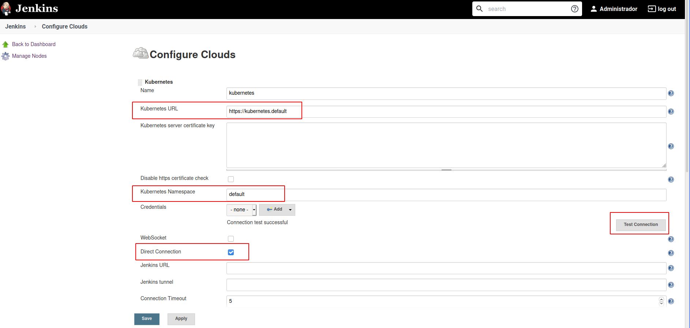
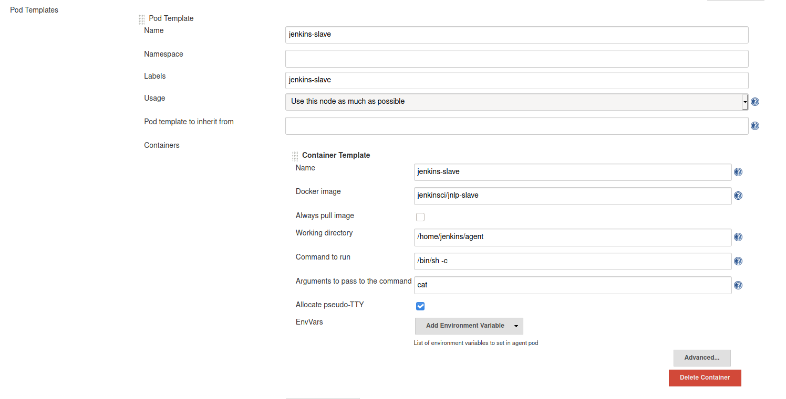

# Escalando Jenkins con Kubernetes

A continuación se explica detalladamente como configurar Jenkins con Kubernetes

## Instalación de Minikube (Linux)

1 - Puedes instalar Minikube en Linux descargando un ejecutable autocontenido:

```
curl -Lo minikube https://storage.googleapis.com/minikube/releases/latest/minikube-linux-amd64 \
  && chmod +x minikube
```

2 - Para tener disponible en la consola el comando minikube, puedes añadir el comando al $PATH o moverlo por ejemplo a /usr/local/bin:

```
sudo cp minikube /usr/local/bin && rm minikube
```

## Iniciación de Kubernetes con Minikube

1 - Creamos un nuevo cluster

```
minikube start --profile develop
```

2 - Consultamos el cluster que acabamos de crear

```
minikube status --profile develop
```

```
develop
type: Control Plane
host: Running
kubelet: Running
apiserver: Running
kubeconfig: Configured
```

3 - Habilitamos el ingress addon de Minikube

```
minikube addons enable ingress --profile develop
```

## Instalando y Configurando Certificado TLS

1 - Instalación de MKCert en Linux

```
sudo apt install libnss3-tools
    -or-
sudo yum install nss-tools
    -or-
sudo pacman -S nss
    -or-
sudo zypper install mozilla-nss-tools
```

Arch Linux

```
sudo pacman -Syu mkcert
```

2 - Generar certificado para Jenkins (local) con MKCert

```
mkdir certificate
cd certificate
mkcert jenkins.localhost.dev '*.localhost.dev' localhost 127.0.0.1 ::1
```

## Desplegando recursos en Kubernetes

1 - Ejecutar el archivo deploy.sh

## Configurando Hosts

A continuación se agrega a nuestras direcciones del Hosts, la ip de Minikube
```
sudo echo $(minikube ip --profile develop) "jenkins.localhost.dev" >> /etc/hosts 
```

## Configurando Agentes de Kubernetes

1 - Inyectar como variable de entorno en el deployment

```
JAVA_OPTS=-Dhudson.TcpSlaveAgentListener.hostName=${service-discovery-name}.${namespace}.svc.cluster.local -Dhudson.TcpSlaveAgentListener.port=${jnlp-port}
```

2 - Configurar Kubernetes https://jenkins.localhost.dev/configureClouds/


3 - Agregar Pod Template 


## Eliminando recursos de Kubernetes

1 - Ejecutar el archivo undeploy.sh